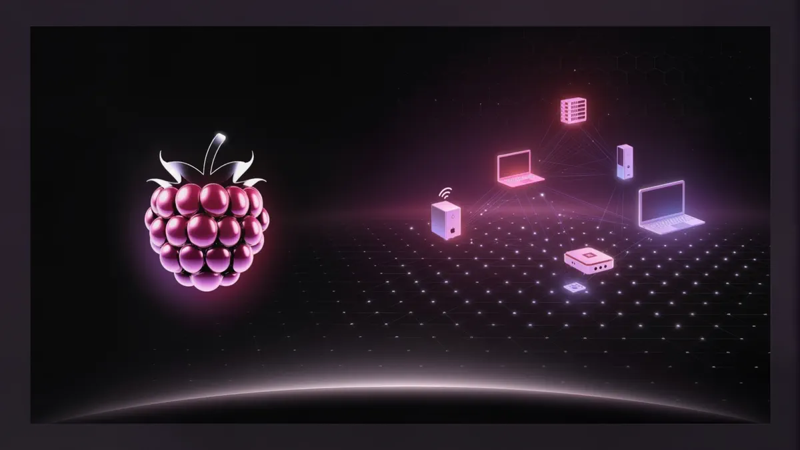

<p align="center">
  
</p>

<h1 align="center">Raspberry</h1>

<p align="center">
  <b>One glass panel. Every machine on your LAN.</b><br>
  <sub>Minimal surface. Deep power. Read-only by default. No cloud.</sub>
</p>

<p align="center">
  <a href="docs/SETUP.md"><b>Setup</b></a> ·
  <a href="docs/UPDATING.md"><b>Updating</b></a> ·
  <a href="docs/MODULES.md"><b>Modules</b></a> ·
  <a href="docs/PHASE-7.md"><b>Phase 7</b></a> ·
  <a href="docs/TROUBLESHOOTING.md"><b>Troubleshooting</b></a>
</p>

Raspberry is a native Windows control panel for your PC and everything on
your LAN — process explorer, terminal, event logs, network scanner, wake-on-
LAN, curated command library, LAN file transfer, OSINT lookup, and more. All
in one matte-black glass UI, all read-only by default, no cloud.

---

## Quick start

**First time on this PC?** → [docs/SETUP.md](docs/SETUP.md) (~10 minutes,
mostly waiting for the first Rust build).

**Already set up?** → double-click **Raspberry** on your Desktop.

**Want the latest features?** → double-click **Update Raspberry** on your
Desktop.

That's the whole daily workflow. No terminal needed.

---

## What's inside

25 modules across four sections. Full list in
[docs/MODULES.md](docs/MODULES.md). Every page has a "?" info button that
pops a plain-language explanation of what the module does — for learning
your way around.

**Deck** — the home screen: live vitals + jump grid.

**Shell + Learning** — [Terminal](docs/MODULES.md#shell) · Commands ·
Packages · Sysinfo Card · Tweaks · **Hotkeys** (searchable keyboard
cheatsheet, 142 shortcuts across Windows / Explorer / browser / VS Code /
Terminal / PowerToys).

**OSINT** — Identity (Holehe / Sherlock) · Domain Intel (WHOIS/RDAP + DNS +
Certificate Transparency).

**Network** — LocalSend · Network · LAN Manager · Presence (persistent LAN
device history) · **SSH** (saved servers, one-click connect, keygen
recipes, plain-language SSH intro) · Watchtower (live TCP radar).

**System + utilities** — System Monitor · Process Explorer · Kernel
Inspector · Files · Storage · Security · Graphs · Logs · Toolbox ·
Automation.

---

## Phase history

**Phase 1 — Shell & Design System** ✅ — matte-black glass UI, design tokens,
top bar, collapsible sidebar rail, routed module panels, status bar, `Ctrl+K`
palette.

**Phase 2 — Local Core** ✅ — shared Rust `crates/core` (sysinfo) exposed to
the frontend through Tauri commands. System Monitor, Process Explorer,
Graphs, and Files show real live data in the native app; the browser preview
uses `MockTarget`.

**Phase 3 — Terminal** ✅ — real tabbed terminal (xterm.js + portable-pty),
PowerShell / CMD / WSL behind a real PTY.

**Phase 4 — Network + discovery** ✅ — Network Dashboard (interfaces, MAC,
local IP, gateway) + LAN Manager (ARP discovery, OUI lookup, Wake-on-LAN) +
live status bar.

**Phase 5 — Power modules + release** ✅ — Commands, Storage, Security, Logs,
Command Deck, cross-module bus.

**Phase 5.5 — Palette & readability polish** ✅ — Commands page redesign,
Recent tab, Ctrl+K palette now searches Windows commands too.

**Phase 5.6 — GitHub power-ups** ✅ — four new modules pulling in proven
tooling:
- **Tweaks** — curated [ChrisTitusTech/winutil](https://github.com/ChrisTitusTech/winutil)
  commands
- **Identity** — [Holehe](https://github.com/megadose/holehe) +
  [Sherlock](https://github.com/sherlock-project/sherlock) OSINT
- **LocalSend** — real [LocalSend](https://github.com/localsend/localsend) v2
  HTTP protocol client
- **Kernel Inspector** — one-click actions backed by
  [System Informer](https://github.com/winsiderss/systeminformer)

**Phase 5.7 — Frictionless updates** ✅ — one-click updater
([`scripts/Update-Raspberry.ps1`](scripts/Update-Raspberry.ps1)) + desktop
shortcuts + docs so daily use never touches a terminal.

**Phase 5.8 — LAN deep scan** ✅ — LAN Manager grew a `/24` ping-sweep that
resolves hostname + RTT for every responsive host; the tiny built-in OUI
table expanded to Amazon, Sonos, Roku, Nintendo, Ubiquiti, ASUS, D-Link and
friends. See [`docs/MODULES.md`](docs/MODULES.md#lan-manager-deep-scan).

**Phase 6 — Remote agent (v0.1)** ✅ — new `apps/agent` Rust binary
(`raspberry-agent`) exposes the shared `core` over HTTP + bearer token so
the Hub on one PC can monitor another. Machine picker in the top bar,
persistent agent list, pairing flow with a live `/health` probe. Read-only
in v0.1; process-kill / WoL / terminal stay Hub-local until mTLS lands. See
[`docs/AGENT.md`](docs/AGENT.md).

**Phase 7 — Packages + Sysinfo Card + live agent health** ✅ — two new
modules and a UX upgrade for the machine picker.
- **Packages** — a full [winget](https://learn.microsoft.com/en-us/windows/package-manager/winget/)
  frontend. Search the catalog, list installed apps, list upgradable, upgrade
  all in one click, or uninstall individual packages. Read-only on remote
  agents (mutations stay Hub-local until the mTLS/allowlist gate lands).
- **Sysinfo Card** — pulls [fastfetch](https://github.com/fastfetch-cli/fastfetch),
  a modern neofetch replacement, and renders its JSON as a big identity card
  (OS, host, kernel, uptime, CPU/GPU, memory, disks). Missing binary? The
  panel shows a one-click `winget install --id Fastfetch-cli.Fastfetch -e`
  and drops it straight into the built-in Terminal.
- **Live agent health** — the machine chip in the top bar now runs a 5s
  `/health` probe against every registered agent. The dot glows green
  (up · ≤1.2s RTT), amber (slow), red (offline), and every row in the
  machine popover shows its own live RTT tag.

**Phase 7.1 — Toolbox + palette machine switch** ✅ — the old "Dev Toolbox"
was a bag of text utilities (JSON pretty-print, Base64, SHA-256 of text)
that any browser devtools already does. Replaced with practical utilities
that fit a LAN control panel:
- **Port Check** — TCP connect (host + port) with hostname resolution and
  latency, backed by a new Rust `tcp_port_check` in `raspberry-core`.
  Quick-buttons for SSH · HTTP · HTTPS · RDP · VNC · Raspberry Agent.
- **Password Generator** — cryptographically-random (`crypto.getRandomValues`)
  with configurable charset and a live entropy read-out.
- **WiFi QR** — generates the official `WIFI:S:…;T:…;P:…;;` code so any
  phone camera can join your network in one tap. Fully offline.
- **URL/Text QR**, **UUID v4**, **Timestamp** (Unix ↔ ISO 8601 / local / UTC,
  with a live "now" tick).

Also: **Ctrl+K** now surfaces `Switch to: <machine>` entries for every
registered agent, so you can retarget without touching the top-bar chip.

**Phase 8.2 — Learning surface + SSH + Tweaks catalog boost** ✅ — the
current pass:
- **"What is this?" info popover** on every module page. Learning-focused —
  click the `?` next to the title, get a plain-language explanation of what
  the module actually does.
- **Hotkeys** — new searchable keyboard cheatsheet: 142 shortcuts across 8
  groups (Windows / Explorer / browser / VS Code / Terminal / PowerToys /
  gaming / text editing). Replaces the old Personas module.
- **SSH** — built out from placeholder to a real three-tab module:
  *Servers* (saved connections, one-click Connect hands the built `ssh…`
  command to the built-in Terminal), *Keys* (ed25519 keygen + agent +
  copy-to-server recipes), and *Learn SSH* (how a connection works, three
  ways to log in, common flags cheatsheet).
- **Tweaks** — catalog roughly doubles from 29 to ~60. New install kits:
  GitHub power tools (gh, lazygit, delta, Fork), terminal upgrades
  (Starship, fzf, ripgrep, bat, zoxide), dev runtimes (Node LTS + Python +
  Rust + Go), containers, AI dev stack (Ollama + LM Studio + Cursor),
  creators, comms, security suite, PowerToys, Sysinternals suite, notes,
  browsers, launchers, hardware monitoring, cleaners, network tools,
  productivity, Nerd Fonts, WSL enable. Plus more debloat / privacy /
  perf / fix / UI entries.
- **Sidebar** — collapsed rail no longer clips icons behind a scrollbar
  gutter.

**Next: Phase 8.3** — Command Deck sparklines (per-agent CPU/RAM history)
and per-agent Sysinfo Card diff view.

**Then: Phase 9 — hardening** — mTLS transport, per-command allow-listing on
the agent, and one-click Windows-service install so the agent survives a
reboot without a login session.

---

## Rebuilding manually

If the shortcut is missing or broken:

```powershell
cd C:\Users\lukep\OneDrive\Documents\ClaudeProject\raspberry
git pull
npm install
npm run tauri:build
apps\hub\src-tauri\target\release\Raspberry.exe
```

Or re-create the shortcuts:

```powershell
.\Install-Raspberry.bat
```

Full docs: [Updating](docs/UPDATING.md) · [Troubleshooting](docs/TROUBLESHOOTING.md) · [Project Audit & Roadmap](docs/project-audit/README.md).

---

## Repo layout

```
raspberry/
├─ package.json            # npm workspace root
├─ Cargo.toml              # Rust workspace
├─ Install-Raspberry.bat   # double-click to place Desktop shortcuts
├─ scripts/
│  ├─ Update-Raspberry.ps1 # git pull + build + launch
│  ├─ Launch-Raspberry.ps1 # just launch the built exe
│  └─ Install-Shortcuts.ps1
├─ docs/
│  ├─ SETUP.md
│  ├─ UPDATING.md
│  ├─ MODULES.md
│  └─ TROUBLESHOOTING.md
├─ crates/core/            # Shared Rust: sysinfo, network, storage, security, logs
├─ apps/agent/             # Rust HTTP server exposing core to a Hub over the LAN
└─ apps/hub/               # Tauri app (React + Rust)
```

---

## Design rules honored

- **Motion:** GPU transforms/opacity only, 130ms ease-out on hover, spring on
  panel enter (Framer Motion).
- **Minimalist:** empty by default; detail blooms on hover/focus.
- **TypeScript strict** (plus `noUncheckedIndexedAccess`,
  `exactOptionalPropertyTypes`).
- **Fonts:** Inter (UI) + JetBrains Mono (numbers/metrics), bundled via
  `@fontsource` so the Tauri window works offline.

---

*Raspberry: one panel, every machine, all yours.*
